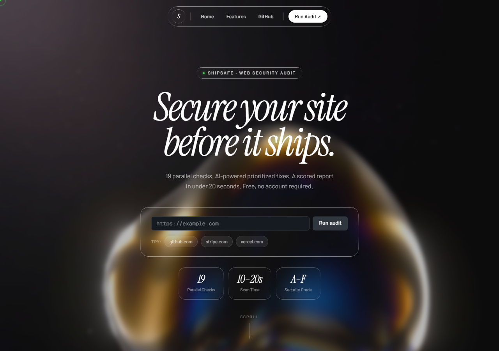
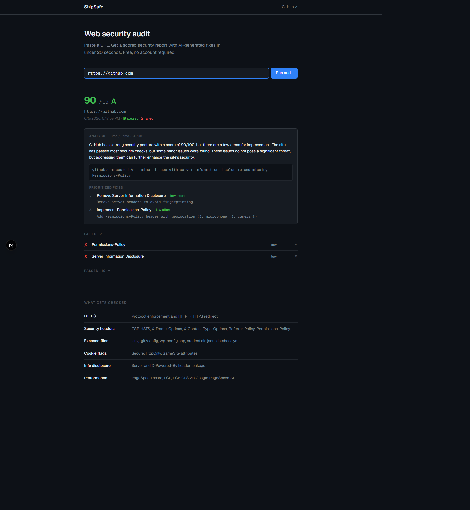
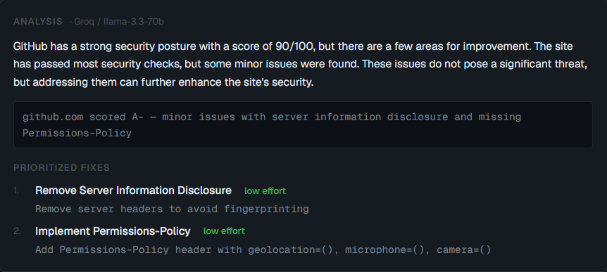
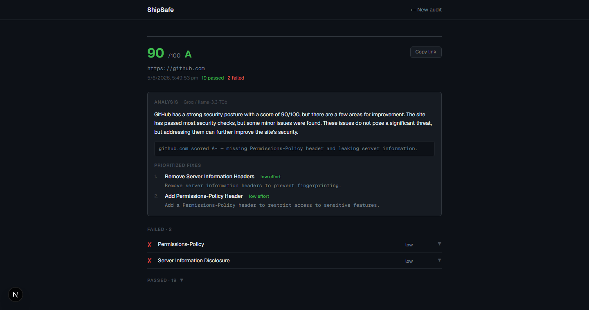
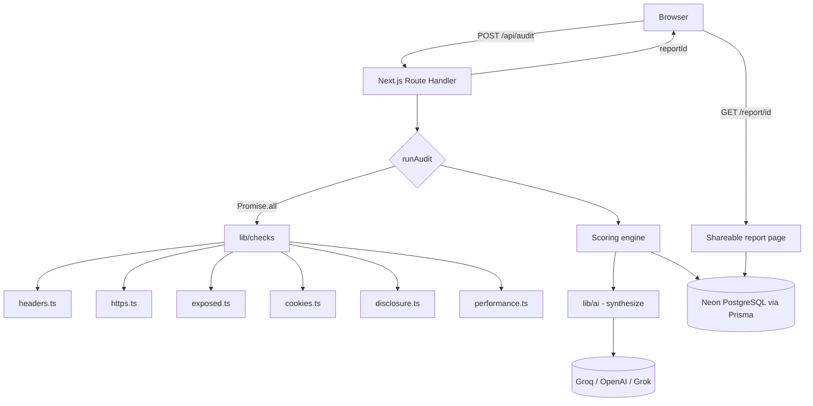

# ShipSafe

ShipSafe is a web security audit tool. Paste a URL and, in roughly fifteen seconds, get a scored report covering HTTPS enforcement, security headers, publicly exposed files, cookie flags, server information disclosure, and performance — followed by an AI-generated, plain-English analysis with a prioritized list of fixes. Every report is saved to a shareable permalink. It is built to be the check a developer runs before they ship.

<p align="left">
  
  
  
  
  
  
</p>

---

## Live Demo

**🔗 https://shipsafe.vercel.app** *(replace with your live Vercel URL)*

Try it on any public website — `https://github.com`, `https://example.com`, or your own project.

---

## Screenshots

| Landing page | Audit results |
|---|---|
|  |  |

| AI analysis | Shareable report |
|---|---|
|  |  |

> See [`SCREENSHOT_GUIDE.md`](SCREENSHOT_GUIDE.md) for exactly how each image is captured.

---

## Features

**Security checks (19 total, run in parallel)**

- **HTTPS** — protocol enforcement and HTTP → HTTPS redirect verification
- **Security headers** — Content-Security-Policy, Strict-Transport-Security (HSTS), X-Frame-Options, X-Content-Type-Options, Referrer-Policy, Permissions-Policy
- **Exposed files** — probes for publicly readable `.env`, `.git/config`, `wp-config.php`, `credentials.json`, `database.yml`, and more
- **Cookie flags** — Secure, HttpOnly, and SameSite attribute inspection
- **Information disclosure** — `Server` and `X-Powered-By` header leakage
- **Performance** — PageSpeed score, LCP, FCP, and CLS via Google PageSpeed Insights (optional, degrades gracefully)

**Scoring & reporting**

- Composite security score (0–100) mapped to a letter grade (A–F)
- AI-generated summary, top risks, and a prioritized fix list ranked by severity and effort
- A one-line shareable verdict for quick sharing
- Persistent, shareable report URLs (`/report/[id]`)

**Engineering**

- Model-agnostic AI provider interface (Groq, OpenAI, or xAI Grok via a single env var)
- Graceful degradation — the core audit works even if the database or AI key is absent
- Fully type-safe, production build passing

---

## How It Works

The scan flow is deliberately simple and fully server-side:

1. A user submits a URL on the landing page.
2. The `/api/audit` route normalizes and validates the URL.
3. Nineteen independent checks fire **in parallel** with `Promise.all`, each making its own HTTP request to the target. No headless browser is involved — every check is a plain `fetch` with a timeout, which keeps the scan fast and cheap.
4. A scoring function applies severity-weighted penalties to produce the 0–100 score and letter grade.
5. The failed checks are passed to the AI layer, which returns a structured JSON analysis (summary, top risks, prioritized fixes).
6. The complete result is saved to PostgreSQL and a shareable `reportId` is returned to the client.

Because each layer is optional and isolated, a missing AI key or database simply removes that feature instead of breaking the scan.

---

## Architecture



All check modules return a common `CheckResult` shape, so adding a new check is a matter of writing one function and registering it in `lib/checks/index.ts`.

---

## Tech Stack

| Layer | Technology |
|---|---|
| Framework | Next.js 16 (App Router) + TypeScript |
| Styling | Tailwind CSS v4, GitHub-dark design system |
| Database | PostgreSQL on Neon (serverless) |
| ORM | Prisma 7 with the `@prisma/adapter-pg` driver adapter |
| AI | Groq `llama-3.3-70b-versatile` (default) — model-agnostic |
| Charts/Data | Native `fetch`, Google PageSpeed Insights API |
| Deployment | Vercel (application) + Neon (database) |

---

## Challenges Solved

These are the non-obvious engineering problems encountered during the build.

**1. Prisma 7 breaking changes.** Prisma 7 removed the `url` field from `schema.prisma` and now requires a driver adapter. I moved the datasource URL into `prisma.config.ts` and wired up `@prisma/adapter-pg` with a `pg` connection pool, rather than copying outdated v5/v6 patterns.

**2. Database null-safety and graceful degradation.** The Prisma client is constructed lazily and returns `null` when `DATABASE_URL` is unset, instead of throwing on import. Every database call is guarded, so the audit still runs and returns results even with no database configured — the only thing lost is the shareable link.

**3. Model-agnostic AI abstraction.** All AI access goes through a single `AIProvider` interface. Groq, OpenAI, and xAI Grok are interchangeable because all three speak the OpenAI-compatible API; switching providers is a one-line environment-variable change with zero code edits.

**4. Vercel timeout handling.** Nineteen parallel network checks plus an LLM call can approach the serverless function timeout. I set an explicit `maxDuration` on the route and run the checks concurrently rather than sequentially, keeping a full scan comfortably inside the limit.

**5. Failure isolation by design.** AI synthesis and database persistence are wrapped so that a failure in either never propagates to the user — the audit is the product, and everything else is an enhancement layered on top.

---

## AI Integration

The AI layer is intentionally decoupled from any single vendor.

```
lib/ai/
├── types.ts              # AIProvider interface
├── index.ts              # Factory — reads AI_PROVIDER and returns a provider
├── synthesize.ts         # Builds the prompt, parses structured JSON output
└── providers/
    ├── groq.ts           # Groq (default)
    ├── openai.ts         # OpenAI
    └── grok.ts           # xAI Grok
```

A single environment variable selects the provider:

```env
AI_PROVIDER=groq    # default — Groq, free and fast
AI_PROVIDER=openai  # OpenAI
AI_PROVIDER=grok    # xAI Grok
```

The synthesis step sends the list of **failed** checks to the model and requests a strict JSON object: a summary, a ranked set of top risks, and a list of fixes tagged by severity and effort. The response is parsed and validated before it reaches the UI, so malformed model output degrades to "no analysis available" rather than crashing the page.

---

## Database Design

A single table backs the shareable-report feature:

```prisma
model AuditReport {
  id        String   @id @default(cuid())
  url       String
  result    Json      // full AuditResult, including checks + AI synthesis
  createdAt DateTime @default(now())
}
```

The complete audit result — checks, scores, and AI analysis — is stored as a `Json` column keyed by a collision-resistant `cuid`. This keeps writes atomic (one insert per scan) and makes the `/report/[id]` page a single primary-key lookup with no joins.

---

## Security Checks

| Category | What it verifies | Severity |
|---|---|---|
| HTTPS protocol | Site is served over TLS | Critical |
| HTTPS redirect | HTTP requests redirect to HTTPS | High |
| HSTS | `Strict-Transport-Security` present | High |
| CSP | `Content-Security-Policy` present | High |
| X-Frame-Options | Clickjacking protection | Medium |
| X-Content-Type-Options | MIME-sniffing protection | Medium |
| Referrer-Policy | Referrer leakage control | Low |
| Permissions-Policy | Feature-permission control | Low |
| Exposed files | `.env`, `.git/config`, etc. not public | Critical |
| Cookie flags | Secure / HttpOnly / SameSite set | High |
| Information disclosure | No stack-revealing headers | Low |
| Performance | PageSpeed score and Core Web Vitals | Medium |

The composite score starts at 100 and subtracts a severity-weighted penalty for each failed check, then maps to a letter grade.

---

## Local Development

```bash
git clone https://github.com/debug949/shipsafe
cd shipsafe
npm install
cp .env.example .env.local
```

Fill in `.env.local`:

```env
DATABASE_URL=       # Neon connection string — neon.tech
AI_PROVIDER=groq
GROK_API_KEY=       # console.groq.com — free tier
GROQ_MODEL=llama-3.3-70b-versatile
```

Set up the database and start the dev server:

```bash
npx prisma db push
npm run dev          # http://localhost:3000
```

The app runs without a database or AI key — you simply lose shareable links and AI analysis respectively. The core audit always works.

---

## Deployment

ShipSafe deploys to Vercel with a Neon database.

1. Push the repository to GitHub.
2. Create a free PostgreSQL database at [neon.tech](https://neon.tech).
3. Run `npx prisma db push` locally against your `DATABASE_URL` to create the table.
4. Import the repository at [vercel.com/new](https://vercel.com/new).
5. Set the environment variables: `DATABASE_URL`, `AI_PROVIDER`, `GROK_API_KEY`.
6. Deploy.

`prisma generate` runs automatically via the `postinstall` script, so Vercel builds the client on every deploy.

---

## Future Improvements

- GitHub repository scanning for committed secrets
- Scheduled re-scans with change alerts when a site's posture degrades
- PDF report export
- Authenticated accounts with scan history
- A free/Pro tier split for monetization
- TLS certificate expiry checks and subdomain enumeration
- Accessibility auditing via `axe-core`

---

## Resume Bullet

> **ShipSafe — Web Security Audit Tool.** Built and deployed a full-stack security scanner (Next.js, TypeScript, Prisma, PostgreSQL) that runs 19 parallel checks and uses an LLM to generate prioritized, plain-English remediation. Designed a model-agnostic AI interface (Groq/OpenAI/Grok) and graceful-degradation architecture so the core product never depends on any single external service.

---

## What This Project Demonstrates

- **Full-stack engineering** — a complete product from URL input to persisted, shareable report, built on the Next.js App Router with type-safe API routes end to end.
- **Security engineering** — working knowledge of OWASP-relevant headers, common file-exposure attack vectors, and cookie-security semantics, encoded as automated checks.
- **AI integration** — prompt design for structured JSON output, response parsing and validation, and a vendor-agnostic provider abstraction.
- **Database design** — a deliberately minimal schema, atomic writes, and primary-key reads using Prisma 7 with a driver adapter.
- **Production deployment** — a real Vercel + Neon pipeline with environment management and an automated client-generation build step.
- **System design** — parallelized I/O, isolated failure domains, and graceful degradation so optional dependencies never break the critical path.

---

<sub>Built by [@debug949](https://github.com/debug949). MIT licensed.</sub>
